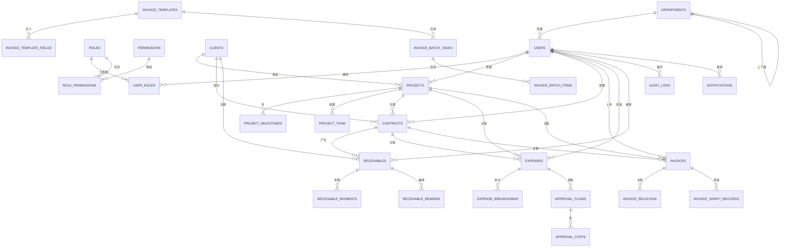
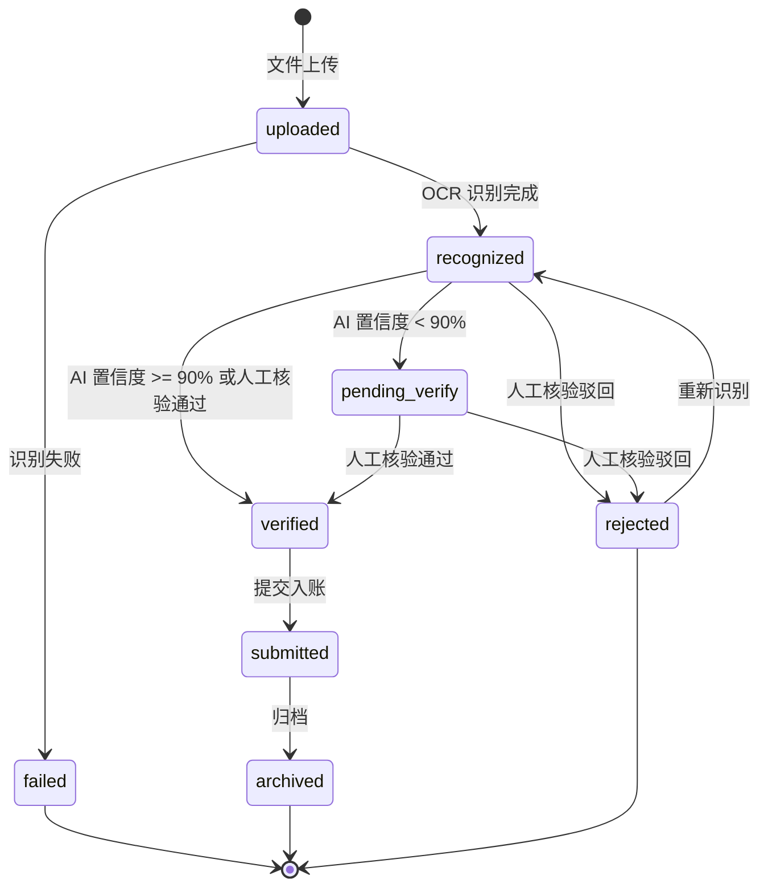
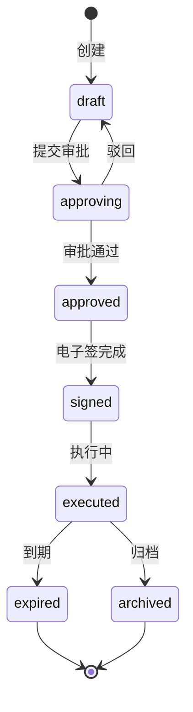
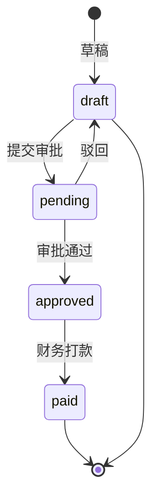
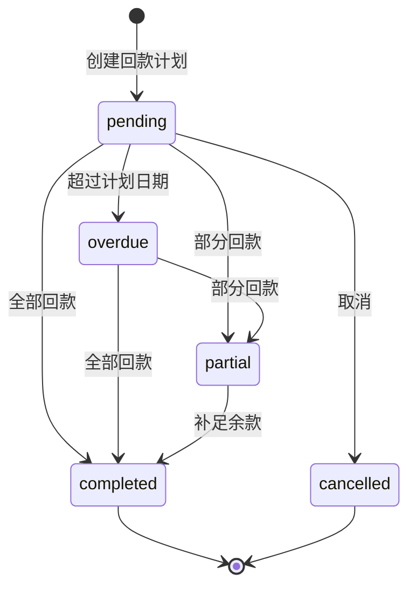
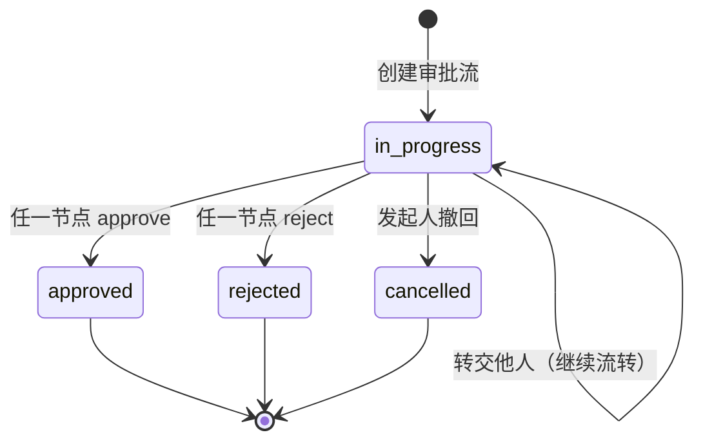

# 数智化管理系统 · 后端架构基线

> 后端工程师**进场第一篇必读**。读完后端就知道：用什么栈、怎么分层、数据怎么存、权限怎么管、状态怎么转。

---

## 1. 技术栈（已确定）

| 维度 | 选型 | 版本 | 理由 |
|------|------|------|------|
| 后端语言 | **Python** | 3.11+ | 与 PaddleOCR 同语言，零摩擦 |
| Web 框架 | **FastAPI** | 0.110+ | 自动 OpenAPI 文档、类型提示、异步支持好 |
| ORM | **SQLAlchemy 2.0** + Alembic | 最新 | 主流、生态好 |
| 数据库 | **PostgreSQL** | 15+ | 金融级稳定性、JSON 字段、全文检索 |
| 缓存 | **Redis** | 7+ | 会话、计数器、SSE 推送 |
| 消息队列 | **Celery + Redis Broker** | 5+ | 异步 OCR、批量查验、邮件发送 |
| OCR 引擎 | **PaddleOCR**（自建） | 2.7+ | 免费开源 |
| 实时通信 | **SSE**（FastAPI `StreamingResponse`） | - | 见 API.md |
| 鉴权 | **JWT**（access + refresh token） | - | 标准方案 |
| 部署 | Docker + docker-compose | - | 后续单独出 |
| 监控 | **Sentry** + **Prometheus + Grafana** | - | 后续单独出 |

> **注意**：如果团队最终选了 Java/Node，告诉我，我会改写 ORM 部分（用 MyBatis-Plus / TypeORM），DDL 主体不变。

---

## 2. 项目结构

```
backend/
├── app/
│   ├── main.py                  # FastAPI 入口
│   ├── config.py                # 配置（pydantic-settings）
│   ├── dependencies.py          # 公共依赖（DB、Redis、当前用户）
│   ├── exceptions.py            # 自定义异常 + 异常处理器
│   │
│   ├── core/                    # 核心能力
│   │   ├── security.py          # JWT 签发/校验、密码加密
│   │   ├── permissions.py       # RBAC 权限检查装饰器
│   │   ├── audit.py             # 审计日志装饰器
│   │   ├── sse.py               # SSE 事件总线（基于 Redis Pub/Sub）
│   │   └── pagination.py
│   │
│   ├── modules/                 # 业务模块（每个子领域一个目录）
│   │   ├── auth/                # 认证
│   │   │   ├── router.py
│   │   │   ├── schemas.py
│   │   │   ├── service.py
│   │   │   └── models.py
│   │   ├── dashboard/
│   │   ├── invoice_ocr/         # 发票识别（含 batch/verify 子域）
│   │   ├── invoice_template/
│   │   ├── expense/             # 销售费用
│   │   ├── project/
│   │   ├── contract/
│   │   ├── receivable/          # 回款
│   │   └── common/              # 公共（字典/上传/用户/客户）
│   │
│   ├── models/                  # SQLAlchemy 模型（按聚合根拆分）
│   ├── schemas/                 # Pydantic DTO（按 API 拆分）
│   ├── tasks/                   # Celery 任务
│   │   ├── ocr_tasks.py
│   │   ├── verify_tasks.py
│   │   └── notify_tasks.py
│   │
│   └── ocr/                     # PaddleOCR 集成（独立服务）
│       ├── server.py            # 独立 FastAPI 端口（8001）
│       ├── engine.py            # OCR 引擎
│       └── postprocess.py       # 字段抽取后处理
│
├── migrations/                  # Alembic 迁移
├── tests/                       # pytest 测试
├── scripts/                     # 数据初始化脚本
└── docker-compose.yml
```

---

## 3. 数据模型 DDL

> 下面 DDL 以 PostgreSQL 15 为目标（用 `MySQL 8` 也兼容，仅 JSON 字段语法略改）。**所有金额字段用 `BIGINT` 存分**，`status` 字段用 `VARCHAR(32)` + CHECK 约束。

### 3.1 用户与权限

```sql
-- ============================================================
-- 用户 / 部门 / 角色（RBAC）
-- ============================================================

-- 部门（树形）
CREATE TABLE departments (
    id              BIGSERIAL PRIMARY KEY,
    name            VARCHAR(64)  NOT NULL,
    parent_id       BIGINT       REFERENCES departments(id) ON DELETE SET NULL,
    manager_id      BIGINT,                      -- 部门负责人
    code            VARCHAR(32)  UNIQUE NOT NULL, -- 财务部 / 销售部
    sort            INT          DEFAULT 0,
    is_active       BOOLEAN      DEFAULT TRUE,
    created_at      TIMESTAMPTZ  DEFAULT NOW(),
    updated_at      TIMESTAMPTZ  DEFAULT NOW()
);
CREATE INDEX idx_dept_parent ON departments(parent_id);

-- 角色
CREATE TABLE roles (
    id              BIGSERIAL PRIMARY KEY,
    name            VARCHAR(32)  UNIQUE NOT NULL,  -- 财务总监 / 销售经理 / 法务 / ...
    code            VARCHAR(32)  UNIQUE NOT NULL,  -- finance_director / sales_manager
    description     TEXT,
    is_builtin      BOOLEAN      DEFAULT FALSE,   -- 内置角色不可删
    data_scope      VARCHAR(16)  NOT NULL DEFAULT 'self',  -- all/dept/dept_sub/self/custom
    created_at      TIMESTAMPTZ  DEFAULT NOW()
);

-- 权限点（资源 + 操作）
CREATE TABLE permissions (
    id              BIGSERIAL PRIMARY KEY,
    code            VARCHAR(64)  UNIQUE NOT NULL,  -- invoice:read / invoice:approve
    resource        VARCHAR(32)  NOT NULL,         -- invoice / contract / ...
    action          VARCHAR(16)  NOT NULL,         -- read / write / approve / export
    name            VARCHAR(64)  NOT NULL,
    description     TEXT
);

-- 角色 - 权限（多对多）
CREATE TABLE role_permissions (
    role_id         BIGINT REFERENCES roles(id) ON DELETE CASCADE,
    permission_id   BIGINT REFERENCES permissions(id) ON DELETE CASCADE,
    PRIMARY KEY (role_id, permission_id)
);

-- 用户
CREATE TABLE users (
    id              BIGSERIAL PRIMARY KEY,
    username        VARCHAR(32)  UNIQUE NOT NULL,  -- 登录名（工号/邮箱/手机）
    email           VARCHAR(128) UNIQUE,
    phone           VARCHAR(20)  UNIQUE,
    name            VARCHAR(32)  NOT NULL,         -- 真实姓名
    avatar          VARCHAR(256),
    password_hash   VARCHAR(128) NOT NULL,        -- bcrypt
    department_id   BIGINT REFERENCES departments(id),
    is_active       BOOLEAN      DEFAULT TRUE,
    is_admin        BOOLEAN      DEFAULT FALSE,   -- 超级管理员（绕过权限）
    last_login_at   TIMESTAMPTZ,
    last_login_ip   VARCHAR(45),
    created_at      TIMESTAMPTZ  DEFAULT NOW(),
    updated_at      TIMESTAMPTZ  DEFAULT NOW()
);
CREATE INDEX idx_user_dept ON users(department_id);

-- 用户 - 角色（多对多，一个用户可多个角色）
CREATE TABLE user_roles (
    user_id         BIGINT REFERENCES users(id) ON DELETE CASCADE,
    role_id         BIGINT REFERENCES roles(id) ON DELETE CASCADE,
    PRIMARY KEY (user_id, role_id)
);

-- 自定义权限（数据范围"自定义"时用）
CREATE TABLE user_custom_permissions (
    user_id         BIGINT REFERENCES users(id) ON DELETE CASCADE,
    permission_id   BIGINT REFERENCES permissions(id) ON DELETE CASCADE,
    resource_id     BIGINT,                       -- 限定到具体资源（项目/合同等）
    PRIMARY KEY (user_id, permission_id, resource_id)
);
```

### 3.2 客户 / 项目 / 合同

```sql
-- ============================================================
-- 客户
-- ============================================================
CREATE TABLE clients (
    id              BIGSERIAL PRIMARY KEY,
    code            VARCHAR(32)  UNIQUE NOT NULL,  -- C-2026-001
    name            VARCHAR(128) NOT NULL,
    short_name      VARCHAR(64),
    tax_no          VARCHAR(32),                   -- 纳税人识别号
    legal_person    VARCHAR(32),
    contact_name    VARCHAR(32),
    contact_phone   VARCHAR(20),
    contact_email   VARCHAR(128),
    address         VARCHAR(256),
    bank_name       VARCHAR(64),
    bank_account    VARCHAR(32),
    industry        VARCHAR(32),
    level           VARCHAR(16)  DEFAULT 'C',      -- A/B/C/D 客户分级
    is_active       BOOLEAN      DEFAULT TRUE,
    remark          TEXT,
    created_by      BIGINT REFERENCES users(id),
    created_at      TIMESTAMPTZ  DEFAULT NOW(),
    updated_at      TIMESTAMPTZ  DEFAULT NOW()
);
CREATE INDEX idx_client_name ON clients(name);

-- ============================================================
-- 项目
-- ============================================================
CREATE TABLE projects (
    id              BIGSERIAL PRIMARY KEY,
    code            VARCHAR(32)  UNIQUE NOT NULL,  -- PRJ-2026-018
    name            VARCHAR(128) NOT NULL,
    type            VARCHAR(32),                   -- SaaS平台升级 / 工程改造 / ...
    client_id       BIGINT REFERENCES clients(id) ON DELETE RESTRICT,
    manager_id      BIGINT REFERENCES users(id),   -- 项目经理
    status          VARCHAR(16)  NOT NULL DEFAULT 'planning',
        -- planning | in_progress | paused | completed | archived
    start_date      DATE,
    end_date        DATE,
    contract_amount BIGINT       DEFAULT 0,        -- 分
    budget          BIGINT       DEFAULT 0,
    spent           BIGINT       DEFAULT 0,
    progress        DECIMAL(5,2) DEFAULT 0,        -- 0-100
    description     TEXT,
    created_at      TIMESTAMPTZ  DEFAULT NOW(),
    updated_at      TIMESTAMPTZ  DEFAULT NOW(),
    CONSTRAINT chk_project_status CHECK (status IN
        ('planning','in_progress','paused','completed','archived'))
);
CREATE INDEX idx_project_client ON projects(client_id);
CREATE INDEX idx_project_manager ON projects(manager_id);

-- 项目里程碑
CREATE TABLE project_milestones (
    id              BIGSERIAL PRIMARY KEY,
    project_id      BIGINT REFERENCES projects(id) ON DELETE CASCADE,
    name            VARCHAR(128) NOT NULL,
    seq             INT          NOT NULL,        -- 顺序
    status          VARCHAR(16)  NOT NULL DEFAULT 'todo',  -- done/current/todo
    planned_start   DATE,
    planned_end     DATE,
    completed_at    TIMESTAMPTZ,
    progress        DECIMAL(5,2) DEFAULT 0,
    operator_id     BIGINT REFERENCES users(id),
    remark          TEXT
);
CREATE INDEX idx_milestone_project ON project_milestones(project_id);

-- 项目团队
CREATE TABLE project_team (
    project_id      BIGINT REFERENCES projects(id) ON DELETE CASCADE,
    user_id         BIGINT REFERENCES users(id) ON DELETE CASCADE,
    role            VARCHAR(32)  NOT NULL,         -- PM/财务/法务/技术/销售
    joined_at       TIMESTAMPTZ  DEFAULT NOW(),
    PRIMARY KEY (project_id, user_id, role)
);

-- ============================================================
-- 合同
-- ============================================================
CREATE TABLE contracts (
    id              BIGSERIAL PRIMARY KEY,
    code            VARCHAR(32)  UNIQUE NOT NULL,  -- HT-2026-031
    name            VARCHAR(128) NOT NULL,
    type            VARCHAR(16)  NOT NULL,         -- sales/purchase/service/framework
    client_id       BIGINT REFERENCES clients(id),
    project_id      BIGINT REFERENCES projects(id),
    manager_id      BIGINT REFERENCES users(id),
    amount          BIGINT       NOT NULL DEFAULT 0,
    currency        VARCHAR(8)   DEFAULT 'CNY',
    sign_date       DATE,
    effective_date  DATE,
    expire_date     DATE,
    payment_method  VARCHAR(32),
    payment_term    VARCHAR(32),
    status          VARCHAR(16)  NOT NULL DEFAULT 'draft',
    summary         TEXT,
    created_at      TIMESTAMPTZ  DEFAULT NOW(),
    updated_at      TIMESTAMPTZ  DEFAULT NOW(),
    CONSTRAINT chk_contract_type CHECK (type IN
        ('sales','purchase','service','framework')),
    CONSTRAINT chk_contract_status CHECK (status IN
        ('draft','approving','approved','signed','executed','expired','archived'))
);
CREATE INDEX idx_contract_client ON contracts(client_id);
CREATE INDEX idx_contract_status ON contracts(status);
```

### 3.3 发票 / 模板 / 费用

```sql
-- ============================================================
-- 发票
-- ============================================================
CREATE TABLE invoices (
    id              BIGSERIAL PRIMARY KEY,
    code            VARCHAR(32)  UNIQUE NOT NULL,  -- INV-2026-0612-001
    invoice_type    VARCHAR(32)  NOT NULL,
    invoice_code    VARCHAR(32),                   -- 发票代码（电子普票 12 位）
    invoice_no      VARCHAR(32),                   -- 发票号码（8-20 位）
    issue_date      DATE,
    seller_name     VARCHAR(128),
    seller_tax_no   VARCHAR(32),
    buyer_name      VARCHAR(128),
    buyer_tax_no    VARCHAR(32),
    total_amount    BIGINT       NOT NULL DEFAULT 0,  -- 分
    total_amount_cn VARCHAR(64),                      -- 大写
    tax_rate        DECIMAL(5,2),
    tax_amount      BIGINT       DEFAULT 0,
    amount_excl_tax BIGINT       DEFAULT 0,
    confidence      DECIMAL(5,2) DEFAULT 0,
    verify_status   VARCHAR(16)  DEFAULT 'pending',  -- pending/verified/failed/expired
    verify_at       TIMESTAMPTZ,
    verify_source   VARCHAR(32),                     -- 国税总局 / 诺诺
    file_url        VARCHAR(256),
    file_size       INT,
    items           JSONB,                           -- 商品明细
    raw_ocr         JSONB,                           -- 原始 OCR 返回
    status          VARCHAR(16)  NOT NULL DEFAULT 'uploaded',
        -- uploaded/recognized/pending_verify/verified/submitted/archived/rejected
    is_linked_contract BOOLEAN   DEFAULT FALSE,
    is_linked_project  BOOLEAN   DEFAULT FALSE,
    uploader_id     BIGINT REFERENCES users(id),
    uploaded_at     TIMESTAMPTZ  DEFAULT NOW(),
    created_at      TIMESTAMPTZ  DEFAULT NOW(),
    updated_at      TIMESTAMPTZ  DEFAULT NOW()
);
CREATE INDEX idx_invoice_no ON invoices(invoice_no);
CREATE INDEX idx_invoice_uploader ON invoices(uploader_id);
CREATE INDEX idx_invoice_status ON invoices(status);
CREATE INDEX idx_invoice_issue_date ON invoices(issue_date);

-- 发票关联合同/项目（多对多）
CREATE TABLE invoice_relations (
    invoice_id      BIGINT REFERENCES invoices(id) ON DELETE CASCADE,
    relation_type   VARCHAR(16) NOT NULL,          -- contract/project/expense/receivable
    relation_id     BIGINT       NOT NULL,
    PRIMARY KEY (invoice_id, relation_type, relation_id)
);
CREATE INDEX idx_inv_rel_type_id ON invoice_relations(relation_type, relation_id);

-- 批量任务（用于 SSE 推送）
CREATE TABLE invoice_batch_tasks (
    id              BIGSERIAL PRIMARY KEY,
    code            VARCHAR(32)  UNIQUE NOT NULL,  -- BATCH-2026-0612-001
    template_id     BIGINT,                          -- 关联模板
    total           INT          DEFAULT 0,
    uploading       INT          DEFAULT 0,
    recognizing     INT          DEFAULT 0,
    success         INT          DEFAULT 0,
    warning         INT          DEFAULT 0,
    failed          INT          DEFAULT 0,
    status          VARCHAR(16)  DEFAULT 'processing',  -- processing/done/error
    uploader_id     BIGINT REFERENCES users(id),
    started_at      TIMESTAMPTZ  DEFAULT NOW(),
    finished_at     TIMESTAMPTZ
);

-- 批量任务文件项
CREATE TABLE invoice_batch_items (
    id              BIGSERIAL PRIMARY KEY,
    batch_id        BIGINT REFERENCES invoice_batch_tasks(id) ON DELETE CASCADE,
    file_id         VARCHAR(64) NOT NULL,
    filename        VARCHAR(256),
    file_size       INT,
    file_url        VARCHAR(256),
    status          VARCHAR(16)  DEFAULT 'queued',  -- queued/uploading/recognizing/success/warning/failed
    progress        DECIMAL(5,2) DEFAULT 0,
    invoice_id      BIGINT REFERENCES invoices(id),
    error_message   TEXT,
    started_at      TIMESTAMPTZ,
    finished_at     TIMESTAMPTZ
);

-- 发票查验
CREATE TABLE invoice_verify_records (
    id              BIGSERIAL PRIMARY KEY,
    code            VARCHAR(32)  UNIQUE NOT NULL,  -- VR-2026-0612-001
    invoice_id      BIGINT REFERENCES invoices(id),
    invoice_code    VARCHAR(32),
    invoice_no      VARCHAR(32),
    issue_date      DATE,
    total_amount    BIGINT,
    result          VARCHAR(16)  NOT NULL,         -- pass/repeat/fake/expired/not_found/risk
    source          VARCHAR(32),                    -- 国税总局
    risk_reason     TEXT,
    elapsed_ms      INT,
    operator_id     BIGINT REFERENCES users(id),
    verified_at     TIMESTAMPTZ  DEFAULT NOW()
);
CREATE INDEX idx_verify_invoice ON invoice_verify_records(invoice_id);

-- ============================================================
-- 发票模板
-- ============================================================
CREATE TABLE invoice_templates (
    id              BIGSERIAL PRIMARY KEY,
    code            VARCHAR(32)  UNIQUE NOT NULL,  -- TPL-TR-2026-001
    name            VARCHAR(128) NOT NULL,
    category        VARCHAR(32),
    description     TEXT,
    icon            VARCHAR(8),
    icon_colors     VARCHAR(64),                     -- "#4F6BFF,#7C3AED"
    default_tax_rate DECIMAL(5,2),
    is_pinned       BOOLEAN      DEFAULT FALSE,
    is_market       BOOLEAN      DEFAULT FALSE,    -- 模板市场
    usage_count     INT          DEFAULT 0,
    rating          DECIMAL(3,2) DEFAULT 5.0,
    status          VARCHAR(16)  DEFAULT 'enabled',  -- enabled/disabled
    creator_id      BIGINT REFERENCES users(id),
    created_at      TIMESTAMPTZ  DEFAULT NOW(),
    updated_at      TIMESTAMPTZ  DEFAULT NOW()
);

-- 模板字段定义（JSONB 存，灵活）
CREATE TABLE invoice_template_fields (
    id              BIGSERIAL PRIMARY KEY,
    template_id     BIGINT REFERENCES invoice_templates(id) ON DELETE CASCADE,
    seq             INT          NOT NULL,
    label           VARCHAR(64)  NOT NULL,
    key             VARCHAR(64)  NOT NULL,         -- invoice_type / totalAmount / ...
    type            VARCHAR(16)  NOT NULL,         -- text/date/amount/rate/user/ref/textarea
    is_required     BOOLEAN      DEFAULT FALSE,
    ai_support      BOOLEAN      DEFAULT TRUE,
    default_value   TEXT,
    linked_field    VARCHAR(64),
    ref_type        VARCHAR(32),                     -- contract/project/user
    options         JSONB,                           -- 字典值
    sort            INT          DEFAULT 0
);

-- ============================================================
-- 销售费用
-- ============================================================
CREATE TABLE expenses (
    id              BIGSERIAL PRIMARY KEY,
    code            VARCHAR(32)  UNIQUE NOT NULL,  -- EX-2026-0612-001
    category        VARCHAR(32)  NOT NULL,         -- 差旅/招待/办公/推广/培训/其他
    title           VARCHAR(128) NOT NULL,
    description     TEXT,
    amount          BIGINT       NOT NULL DEFAULT 0,
    currency        VARCHAR(8)   DEFAULT 'CNY',
    expense_date    DATE         NOT NULL,
    applicant_id    BIGINT REFERENCES users(id) NOT NULL,
    department_id   BIGINT REFERENCES departments(id),
    contract_id     BIGINT REFERENCES contracts(id),
    project_id      BIGINT REFERENCES projects(id),
    cost_center     VARCHAR(32),
    status          VARCHAR(16)  DEFAULT 'draft',  -- draft/pending/approved/rejected/paid
    submit_at       TIMESTAMPTZ,
    finish_at       TIMESTAMPTZ,
    created_at      TIMESTAMPTZ  DEFAULT NOW(),
    updated_at      TIMESTAMPTZ  DEFAULT NOW()
);
CREATE INDEX idx_expense_applicant ON expenses(applicant_id);
CREATE INDEX idx_expense_status ON expenses(status);
CREATE INDEX idx_expense_date ON expenses(expense_date);

-- 费用明细拆分（如差旅=机票+酒店+打车+餐补）
CREATE TABLE expense_breakdowns (
    id              BIGSERIAL PRIMARY KEY,
    expense_id      BIGINT REFERENCES expenses(id) ON DELETE CASCADE,
    label           VARCHAR(32)  NOT NULL,         -- 机票/酒店/打车/餐补
    amount          BIGINT       NOT NULL DEFAULT 0,
    remark          TEXT
);

-- 费用审批流（通用，所有审批流都用此结构）
CREATE TABLE approval_flows (
    id              BIGSERIAL PRIMARY KEY,
    business_type   VARCHAR(32)  NOT NULL,         -- expense/contract/invoice/...
    business_id     BIGINT       NOT NULL,         -- 关联业务表 ID
    template_id     BIGINT,                          -- 审批模板（可选）
    status          VARCHAR(16)  DEFAULT 'in_progress',  -- in_progress/approved/rejected/cancelled
    current_step    INT          DEFAULT 1,
    total_steps     INT          NOT NULL,
    started_at      TIMESTAMPTZ  DEFAULT NOW(),
    finished_at     TIMESTAMPTZ
);
CREATE INDEX idx_af_biz ON approval_flows(business_type, business_id);

-- 审批步骤
CREATE TABLE approval_steps (
    id              BIGSERIAL PRIMARY KEY,
    flow_id         BIGINT REFERENCES approval_flows(id) ON DELETE CASCADE,
    seq             INT          NOT NULL,
    name            VARCHAR(64)  NOT NULL,         -- 提交/直属上级/财务审核/总经理审批
    approver_id     BIGINT REFERENCES users(id),
    status          VARCHAR(16)  DEFAULT 'todo',  -- todo/current/done/rejected/transferred
    action          VARCHAR(16),                     -- approve/reject/transfer
    comment         TEXT,
    trigger_rule    VARCHAR(256),                    -- amount >= 5000
    finished_at     TIMESTAMPTZ
);
CREATE INDEX idx_step_flow ON approval_steps(flow_id);
```

### 3.4 回款

```sql
-- ============================================================
-- 回款
-- ============================================================
CREATE TABLE receivables (
    id              BIGSERIAL PRIMARY KEY,
    code            VARCHAR(32)  UNIQUE NOT NULL,  -- HK-2026-018
    contract_id     BIGINT REFERENCES contracts(id),
    client_id       BIGINT REFERENCES clients(id),
    type            VARCHAR(32),                      -- 合同尾款/预付款/进度款
    plan_amount     BIGINT       NOT NULL DEFAULT 0,  -- 分
    received_amount BIGINT       NOT NULL DEFAULT 0,
    plan_date       DATE         NOT NULL,
    actual_date     DATE,
    term_days       INT          DEFAULT 30,
    manager_id      BIGINT REFERENCES users(id),
    bank_account    VARCHAR(64),
    status          VARCHAR(16)  DEFAULT 'pending',   -- pending/partial/completed/overdue
    overdue_days    INT          DEFAULT 0,
    remark          TEXT,
    created_at      TIMESTAMPTZ  DEFAULT NOW(),
    updated_at      TIMESTAMPTZ  DEFAULT NOW(),
    CONSTRAINT chk_recv_status CHECK (status IN
        ('pending','partial','completed','overdue','cancelled'))
);
CREATE INDEX idx_recv_contract ON receivables(contract_id);
CREATE INDEX idx_recv_client ON receivables(client_id);
CREATE INDEX idx_recv_status ON receivables(status);
CREATE INDEX idx_recv_plan_date ON receivables(plan_date);

-- 回款到账记录（一笔回款可分多次到账）
CREATE TABLE receivable_payments (
    id              BIGSERIAL PRIMARY KEY,
    receivable_id   BIGINT REFERENCES receivables(id) ON DELETE CASCADE,
    amount          BIGINT       NOT NULL DEFAULT 0,
    received_at     DATE         NOT NULL,
    bank_statement  VARCHAR(256),                    -- 银行流水凭证文件
    remark          TEXT,
    operator_id     BIGINT REFERENCES users(id),
    created_at      TIMESTAMPTZ  DEFAULT NOW()
);

-- 催收记录
CREATE TABLE receivable_reminds (
    id              BIGSERIAL PRIMARY KEY,
    receivable_id   BIGINT REFERENCES receivables(id) ON DELETE CASCADE,
    type            VARCHAR(16)  NOT NULL,         -- phone/email/wechat/letter
    contact_person  VARCHAR(64),
    content         TEXT,
    attachments     JSONB,                         -- 文件 ID 列表
    operator_id     BIGINT REFERENCES users(id),
    created_at      TIMESTAMPTZ  DEFAULT NOW()
);
```

### 3.5 公共 / 审计

```sql
-- ============================================================
-- 字典
-- ============================================================
CREATE TABLE dictionaries (
    id              BIGSERIAL PRIMARY KEY,
    dict_type       VARCHAR(32)  NOT NULL,         -- expense_category / contract_type
    value           VARCHAR(64)  NOT NULL,
    label           VARCHAR(64)  NOT NULL,
    color           VARCHAR(16),
    sort            INT          DEFAULT 0,
    is_active       BOOLEAN      DEFAULT TRUE
);
CREATE UNIQUE INDEX idx_dict_type_value ON dictionaries(dict_type, value);

-- ============================================================
-- 审计日志（重要！企业自用必须有）
-- ============================================================
CREATE TABLE audit_logs (
    id              BIGSERIAL PRIMARY KEY,
    operator_id     BIGINT REFERENCES users(id),
    operator_name   VARCHAR(32),                     -- 冗余，避免 join
    action          VARCHAR(32)  NOT NULL,         -- create/update/delete/approve/reject/export/login
    resource_type   VARCHAR(32)  NOT NULL,         -- invoice/contract/...
    resource_id     BIGINT,
    resource_code   VARCHAR(64),                     -- 冗余
    before_value    JSONB,                           -- 修改前快照
    after_value     JSONB,                           -- 修改后快照
    diff            JSONB,                           -- 字段级 diff
    ip              VARCHAR(45),
    user_agent      VARCHAR(256),
    created_at      TIMESTAMPTZ  DEFAULT NOW()
);
CREATE INDEX idx_audit_operator ON audit_logs(operator_id);
CREATE INDEX idx_audit_resource ON audit_logs(resource_type, resource_id);
CREATE INDEX idx_audit_created ON audit_logs(created_at);

-- ============================================================
-- 文件
-- ============================================================
CREATE TABLE files (
    id              VARCHAR(32)  PRIMARY KEY,      -- F-2026-001
    name            VARCHAR(256) NOT NULL,
    ext             VARCHAR(16),
    size            INT,
    mime_type       VARCHAR(64),
    url             VARCHAR(512) NOT NULL,
    storage         VARCHAR(16)  DEFAULT 'local',  -- local/s3/oss
    uploader_id     BIGINT REFERENCES users(id),
    biz_type        VARCHAR(32),                      -- invoice/contract/expense
    biz_id          BIGINT,
    created_at      TIMESTAMPTZ  DEFAULT NOW()
);

-- ============================================================
-- 通知
-- ============================================================
CREATE TABLE notifications (
    id              BIGSERIAL PRIMARY KEY,
    user_id         BIGINT REFERENCES users(id) ON DELETE CASCADE,
    type            VARCHAR(32)  NOT NULL,         -- todo/mention/system
    title           VARCHAR(128) NOT NULL,
    content         TEXT,
    link            VARCHAR(256),
    is_read         BOOLEAN      DEFAULT FALSE,
    read_at         TIMESTAMPTZ,
    created_at      TIMESTAMPTZ  DEFAULT NOW()
);
CREATE INDEX idx_notif_user_unread ON notifications(user_id, is_read);
```

---

## 4. 实体关系图（ER）



---

## 5. 状态流转图

### 5.1 发票状态



### 5.2 合同状态



### 5.3 费用状态



### 5.4 回款状态



### 5.5 审批流状态



---

## 6. RBAC 权限矩阵

> 完整矩阵见下方。前端通过 `POST /common/permissions` 拿到当前用户的所有权限点，控制按钮显隐。

### 6.1 角色定义

| 角色 code | 名称 | data_scope | 备注 |
|-----------|------|------------|------|
| `super_admin` | 超级管理员 | all | 绕过权限检查 |
| `finance_director` | 财务总监 | dept | 财务部全部数据 |
| `finance_specialist` | 财务专员 | self | 自己录入的数据 |
| `sales_manager` | 销售经理 | dept_sub | 销售部+下属项目 |
| `sales_rep` | 销售 | self | 自己负责的数据 |
| `legal` | 法务 | all | 合同审核跨部门 |
| `project_manager` | 项目经理 | custom | 自己管理的项目 |
| `project_member` | 项目成员 | custom | 参与的项目 |
| `executive` | 总经理 | all | 看所有数据，审批大额 |

### 6.2 资源 × 操作 × 角色 矩阵

> ✅ = 允许  ⛔ = 拒绝  👁 = 只读  ① = 自己的数据  ② = 部门数据  ③ = 全部

| 资源 / 操作 | super_admin | finance_director | finance_specialist | sales_manager | sales_rep | legal | project_manager | project_member | executive |
|------------|-------------|------------------|-------------------|--------------|-----------|-------|-----------------|----------------|-----------|
| **发票识别** |
| 发票：上传 | ✅ | ✅ | ✅ | ✅ | ✅ | ⛔ | ✅ | ✅ | 👁 |
| 发票：查看 | ✅ | ② | ① | ② | ① | 👁 | ② | ② | 👁 |
| 发票：编辑字段 | ✅ | ✅ | ✅ | ⛔ | ⛔ | ⛔ | ⛔ | ⛔ | ⛔ |
| 发票：核验 | ✅ | ✅ | ✅ | ⛔ | ⛔ | ⛔ | ⛔ | ⛔ | ⛔ |
| 发票：提交入账 | ✅ | ✅ | ⛔ | ⛔ | ⛔ | ⛔ | ⛔ | ⛔ | ⛔ |
| 发票：导出 | ✅ | ✅ | ⛔ | ✅ | ① | ⛔ | ② | ⛔ | 👁 |
| 发票：查验 | ✅ | ✅ | ✅ | ⛔ | ⛔ | ⛔ | ⛔ | ⛔ | ⛔ |
| **发票模板** |
| 模板：查看 | ✅ | ✅ | ✅ | ✅ | ✅ | ✅ | ✅ | ✅ | ✅ |
| 模板：创建/编辑 | ✅ | ✅ | ✅ | ⛔ | ⛔ | ⛔ | ⛔ | ⛔ | ⛔ |
| 模板：删除 | ✅ | ✅（自己创建） | ✅（自己创建） | ⛔ | ⛔ | ⛔ | ⛔ | ⛔ | ⛔ |
| 模板：发布到市场 | ✅ | ⛔ | ⛔ | ⛔ | ⛔ | ⛔ | ⛔ | ⛔ | ⛔ |
| **销售费用** |
| 费用：录入 | ✅ | ✅ | ✅ | ✅ | ✅ | ⛔ | ✅ | ✅ | 👁 |
| 费用：查看 | ✅ | ② | ① | ② | ① | 👁 | ② | ② | 👁 |
| 费用：审批 | ✅ | ✅ | ⛔ | ⛔ | ⛔ | ⛔ | ⛔ | ⛔ | ✅（≥ 5 万） |
| 费用：导出 | ✅ | ✅ | ⛔ | ✅ | ① | ⛔ | ② | ⛔ | 👁 |
| **项目管理** |
| 项目：创建 | ✅ | ⛔ | ⛔ | ✅ | ⛔ | ⛔ | ✅ | ⛔ | ⛔ |
| 项目：编辑 | ✅ | ⛔ | ⛔ | ✅ | ① | ⛔ | ✅ | ⛔ | ⛔ |
| 项目：查看 | ✅ | ✅ | ✅ | ② | ① | 👁 | ② | ② | 👁 |
| 项目：删除 | ✅ | ⛔ | ⛔ | ✅ | ⛔ | ⛔ | ✅ | ⛔ | ⛔ |
| 里程碑：编辑 | ✅ | ⛔ | ⛔ | ✅ | ⛔ | ⛔ | ✅ | ① | ⛔ |
| **合同管理** |
| 合同：创建 | ✅ | ⛔ | ⛔ | ✅ | ✅ | ✅ | ✅ | ⛔ | ⛔ |
| 合同：编辑 | ✅ | ⛔ | ⛔ | ✅ | ① | ✅ | ② | ⛔ | ⛔ |
| 合同：查看 | ✅ | ② | ① | ② | ① | ③ | ② | ② | 👁 |
| 合同：审批 | ✅ | ✅ | ⛔ | ⛔ | ⛔ | ✅ | ⛔ | ⛔ | ✅（≥ 5 万） |
| 合同：电子签 | ✅ | ⛔ | ⛔ | ✅ | ① | ✅ | ⛔ | ⛔ | ⛔ |
| 合同：归档 | ✅ | ✅ | ✅ | ✅ | ⛔ | ✅ | ⛔ | ⛔ | ⛔ |
| **回款管理** |
| 回款：创建计划 | ✅ | ✅ | ✅ | ✅ | ✅ | ⛔ | ✅ | ⛔ | ⛔ |
| 回款：登记到账 | ✅ | ✅ | ✅ | ✅ | ① | ⛔ | ⛔ | ⛔ | ⛔ |
| 回款：催收 | ✅ | ✅ | ✅ | ✅ | ✅ | ✅ | ✅ | ⛔ | ⛔ |
| 回款：标记坏账 | ✅ | ✅ | ⛔ | ⛔ | ⛔ | ⛔ | ⛔ | ⛔ | ✅ |
| 回款：查看 | ✅ | ② | ① | ② | ① | 👁 | ② | ② | 👁 |
| **系统** |
| 用户管理 | ✅ | ⛔ | ⛔ | ⛔ | ⛔ | ⛔ | ⛔ | ⛔ | ⛔ |
| 角色管理 | ✅ | ⛔ | ⛔ | ⛔ | ⛔ | ⛔ | ⛔ | ⛔ | ⛔ |
| 部门管理 | ✅ | ⛔ | ⛔ | ⛔ | ⛔ | ⛔ | ⛔ | ⛔ | ⛔ |
| 审计日志 | ✅ | ✅ | ⛔ | ⛔ | ⛔ | ⛔ | ⛔ | ⛔ | 👁 |
| 字典管理 | ✅ | ⛔ | ⛔ | ⛔ | ⛔ | ⛔ | ⛔ | ⛔ | ⛔ |

### 6.3 权限 code 清单

```
系统：
  user:read, user:write
  role:read, role:write
  dept:read, dept:write
  audit:read
  dict:read, dict:write

发票识别：
  invoice:upload, invoice:read, invoice:write, invoice:verify
  invoice:submit, invoice:export
  invoice:batch_upload, invoice:batch_action
  invoice:verify_single, invoice:verify_batch

发票模板：
  template:read, template:write, template:delete
  template:publish

销售费用：
  expense:read, expense:write, expense:submit
  expense:approve, expense:export

项目管理：
  project:read, project:write, project:delete
  milestone:write

合同管理：
  contract:read, contract:write, contract:approve
  contract:sign, contract:archive

回款管理：
  receivable:read, receivable:write
  receivable:remind, receivable:bad_debt
```

### 6.4 权限实现示例（FastAPI）

```python
from functools import wraps
from fastapi import HTTPException, Depends

# 权限装饰器
def require_permission(perm_code: str):
    def decorator(func):
        @wraps(func)
        async def wrapper(*args, current_user=Depends(get_current_user), **kwargs):
            if current_user.is_admin:
                return await func(*args, current_user=current_user, **kwargs)
            if perm_code not in current_user.permissions:
                raise HTTPException(status_code=1003, detail="无权限访问")
            return await func(*args, current_user=current_user, **kwargs)
        return wrapper
    return decorator

# 数据范围过滤（自动）
def filter_by_data_scope(query, user, model):
    if user.is_admin or user.data_scope == 'all':
        return query
    if user.data_scope == 'self':
        return query.filter(model.applicant_id == user.id)
    if user.data_scope == 'dept':
        return query.join(Users, Users.id == model.applicant_id)\
                    .filter(Users.department_id == user.department_id)
    # 'dept_sub' / 'custom' 类似
    return query
```

---

## 7. 关键技术点

### 7.1 SSE 实现（FastAPI）

```python
from fastapi.responses import StreamingResponse
import asyncio
import json

async def batch_progress_stream(batch_id: str):
    """SSE 端点：实时推送批量任务进度"""
    pubsub = redis.pubsub()
    await pubsub.subscribe(f"batch:{batch_id}")

    try:
        # 连接成功事件
        yield f"event: connected\ndata: {json.dumps({'batchId': batch_id})}\n\n"

        # 心跳
        async def keepalive():
            while True:
                await asyncio.sleep(30)
                yield f"event: keepalive\ndata: {{}}\n\n"

        keepalive_task = asyncio.create_task(keepalive())

        async for message in pubsub.listen():
            if message['type'] != 'message':
                continue
            data = json.loads(message['data'])
            event_type = data.pop('type', 'progress')
            yield f"event: {event_type}\ndata: {json.dumps(data)}\n\n"

            if event_type == 'completed':
                keepalive_task.cancel()
                break
    finally:
        await pubsub.unsubscribe(f"batch:{batch_id}")
        await pubsub.close()

@app.get("/sse/invoice/batch/{batch_id}")
async def sse_batch(batch_id: str, token: str):
    user = await verify_token(token)
    return StreamingResponse(
        batch_progress_stream(batch_id),
        media_type="text/event-stream",
        headers={
            "Cache-Control": "no-cache",
            "X-Accel-Buffering": "no",
        }
    )
```

### 7.2 OCR 集成

```python
# tasks/ocr_tasks.py
from celery import shared_task
import httpx

@shared_task(bind=True, max_retries=3)
def recognize_invoice(self, file_id: str, batch_id: str, file_url: str):
    try:
        # 调用 PaddleOCR 服务（同语言，直接 import 或 HTTP）
        with httpx.Client(timeout=30) as client:
            resp = client.post(
                "http://ocr-service:8001/recognize",
                json={"file_url": file_url, "fields": ["invoiceType", "invoiceNo", "totalAmount"]}
            )
            ocr_result = resp.json()

        # 写入数据库
        invoice = save_invoice_with_ocr(ocr_result, file_id)

        # 推送 SSE
        redis.publish(f"batch:{batch_id}", json.dumps({
            "type": "item_done",
            "fileId": file_id,
            "invoiceId": invoice.id,
            "confidence": ocr_result["confidence"]
        }))
        return invoice.id
    except Exception as e:
        # 失败推送
        redis.publish(f"batch:{batch_id}", json.dumps({
            "type": "progress",
            "fileId": file_id,
            "status": "failed",
            "error": str(e)
        }))
        raise self.retry(exc=e, countdown=5)
```

### 7.3 金额处理（避免浮点精度问题）

```python
# 内部计算用分（int）
amount_cents = 28000_00  # ¥ 28,000.00

# 返回前端时转元（decimal，2 位）
from decimal import Decimal
amount_yuan = (Decimal(amount_cents) / 100).quantize(Decimal("0.01"))

# 数据库 BIGINT 存分
invoice = Invoice(total_amount=amount_cents)

# API 响应（pydantic schema）
class InvoiceSchema(BaseModel):
    total_amount: Decimal  # 2 位小数，元

    @field_serializer('total_amount')
    def serialize_amount(self, v: Decimal) -> str:
        return f"{v:.2f}"
```

---

## 8. 与已有文档的关系

| 文档 | 关系 |
|------|------|
| `API.md` | 59 个接口的请求/响应；本文件定义**数据怎么存** |
| `OCR-选型.md` | OCR 服务选型；本文件定义**怎么调用** |
| `assets/common.css` | 前端样式；本文件定义**后端如何支撑前端权限控制** |
| `invoice-ocr-batch.html` 末尾的 `BatchOCRSSE` 类 | 前端实现；本文件后端对应实现见 §7.1 |

---

## 9. 进场清单

后端工程师入场后，按这个顺序推进：

### Week 1：基础
- [ ] 拉取代码，初始化 FastAPI 项目骨架
- [ ] 配置数据库连接（PostgreSQL + SQLAlchemy）
- [ ] 配置 Redis 连接
- [ ] 实现 `core/security.py`（JWT、密码加密）
- [ ] 实现 `core/permissions.py`（RBAC 装饰器 + 数据范围过滤）
- [ ] 实现 `core/sse.py`（事件总线）
- [ ] 实现 `core/audit.py`（审计装饰器）
- [ ] 实现 `auth` 模块（登录、SSO、登出）
- [ ] 跑通 Alembic 迁移，建出所有表

### Week 2：核心业务
- [ ] 客户/部门/用户/角色 CRUD
- [ ] 发票识别（含批量 + SSE）
- [ ] PaddleOCR 服务对接
- [ ] 发票查验（诺诺接口对接）

### Week 3：业务
- [ ] 销售费用（含审批流）
- [ ] 项目管理（含里程碑）
- [ ] 合同管理（含审批流 + 电子签）
- [ ] 回款管理

### Week 4：打磨
- [ ] Dashboard 聚合接口
- [ ] 通知系统
- [ ] 审计日志完整接入
- [ ] 全接口 Swagger 文档
- [ ] 单元测试覆盖率 > 60%
- [ ] Docker compose 部署
- [ ] 压测（QPS 200 / P99 < 300ms）

---

## 10. 联系与变更

- **API 字段命名变更**：必须经 PM + 后端 + 前端三方确认
- **数据库表结构变更**：必须写 Alembic 迁移，**禁止直接改表**
- **新模块添加**：先更新本文件 → 评审 → 实现

> 这份文档由 PM 维护，后端/前端有疑问先翻这里。
